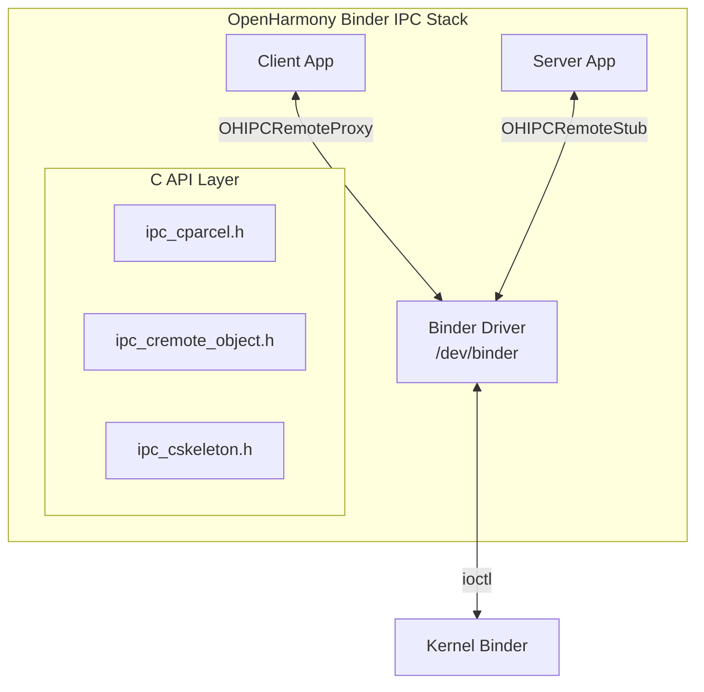

# OpenHarmony Binder IPC 纯C实现

## 实现方案概述

本实现使用 **OpenHarmony 官方 IPC C API** (`libipc_capi.so`) 提供了纯 C 语言的 Binder IPC 方案。

### 关键组件



### 文件列表

| 文件 | 说明 |
|------|------|
| `include/oh_ipc_binder.h` | Binder IPC 头文件（纯C API） |
| `src/oh_ipc_binder.c` | Binder IPC 实现 |
| `src/ohipc_service.c` | 服务端示例 |
| `src/ohipc_client.c` | 客户端示例 |

## 技术实现细节

### 1. 使用的 OpenHarmony API

```c
// IPC C API (OpenHarmony 12+)
#include "ipc_cparcel.h"          // Parcel 序列化/反序列化
#include "ipc_cremote_object.h"   // RemoteStub/RemoteProxy
#include "ipc_cskeleton.h"        // IPC骨架（JoinWorkThread等）
#include "ipc_error_code.h"       // 错误码定义
```

### 2. 限制与Workaround

**主要限制**：SAMgr (System Ability Manager) 没有 C API，只有 C++ 接口。

**解决方案**：使用 Unix socket 作为服务发现机制：

```
服务注册流程：
1. 服务端创建 OHIPCRemoteStub
2. 创建 Unix socket 监听（/data/local/tmp/ohipc/{service}.sock）
3. 客户端通过 Unix socket 获取 binder 句柄
4. 创建 OHIPCRemoteProxy
5. 后续通信走 Binder 驱动
```

## 编译

```bash
# 编译所有 IPC demo
./build.sh --product-name rk3568 --build-target //applications/sample/ipc_demo:ipc_demo

# 单独编译 Binder IPC 示例
./build.sh --product-name rk3568 --build-target //applications/sample/ipc_demo:ohipc_service
./build.sh --product-name rk3568 --build-target //applications/sample/ipc_demo:ohipc_client
```

## 使用方法

### 1. 启动服务端

```bash
/system/bin/ohipc_service [service_name]
```

### 2. 启动客户端

```bash
/system/bin/ohipc_client [service_name]
```

### 3. 客户端命令

| 命令 | 功能 |
|------|------|
| `1` | 发送状态查询 (cmd=0x00010001) |
| `2` | 发送数据上报 (cmd=0x00020001) |
| `3` | 发送控制命令 (cmd=0x00030001) |
| `4` | 发送自定义二进制数据 |
| `5` | 发送大数据压力测试 (100KB) |
| `s` | 显示连接状态 |
| `d` | 手动断开连接 |
| `r` | 手动重连 |
| `q` | 退出 |

## API 使用示例

### 服务端

```c
#include "oh_ipc_binder.h"

// 消息回调
void OnMessage(uint32_t type, uint32_t cmdCode,
               const uint8_t *data, uint32_t len, void *userData) {
    // 处理收到的二进制数据
    printf("Received %u bytes, cmd=0x%08X\n", len, cmdCode);
}

int main() {
    OhIpcConfig config = {
        .serviceName = "my.binary.service",
        .isServer = true,
        .onMessage = OnMessage,
        .onConnect = OnConnect,
    };
    
    OhIpcContext *ctx = OhIpcInit(&config);
    OhIpcServerStart(ctx);  // 阻塞直到服务启动
    
    // 等待客户端连接
    OH_IPCSkeleton_JoinWorkThread();  // 进入IPC工作线程
    
    OhIpcServerStop(ctx);
    OhIpcDestroy(ctx);
}
```

### 客户端

```c
#include "oh_ipc_binder.h"

void OnMessage(uint32_t type, uint32_t cmdCode,
               const uint8_t *data, uint32_t len, void *userData) {
    // 处理服务端主动发送的消息
}

int main() {
    OhIpcConfig config = {
        .serviceName = "my.binary.service",
        .isServer = false,
        .enableReconnect = true,     // 自动重连
        .onMessage = OnMessage,
        .onConnect = OnConnect,
        .onDeath = OnDeath,          // 服务死亡监听
    };
    
    OhIpcContext *ctx = OhIpcInit(&config);
    OhIpcClientConnect(ctx, 5000);  // 5秒超时
    
    // 发送二进制数据
    uint8_t data[] = {0x01, 0x02, 0x03, 0x04};
    OhIpcClientSend(ctx, 0x00010001, data, sizeof(data), true);
    
    OhIpcClientDisconnect(ctx);
    OhIpcDestroy(ctx);
}
```

## 与 Socket IPC 对比

| 特性 | Socket IPC | Binder IPC |
|------|------------|------------|
| 驱动 | Unix Socket | Binder (/dev/binder) |
| 性能 | 内核拷贝 | 内存映射，更高效 |
| 安全 | 文件权限 | UID/PID 校验 |
| 服务发现 | 硬编码路径 | SAMgr (需要C++) |
| 死亡通知 | 心跳检测 | 自动回调 |
| 数据大小 | 无限制（可用sendfile） | ~200KB限制 |
| 跨设备 | ❌ | ✅ (通过RPC) |
| 纯C支持 | ✅ | ⚠️ (SAMgr需要C++) |

## 生产环境建议

### 方案1：混合实现（推荐）

```c
// 使用 C++ 包装 SAMgr 注册（约50行）
// samgr_wrapper.cpp
extern "C" int RegisterService(int32_t saId, void *stub) {
    auto samgr = SystemAbilityManagerClient::GetInstance()
                    .GetSystemAbilityManager();
    return samgr->AddSystemAbility(saId, (IRemoteObject*)stub);
}

// 主业务使用纯 C
// service.c
extern int RegisterService(int32_t saId, void *stub);
int main() {
    OHIPCRemoteStub *stub = OH_IPCRemoteStub_Create(...);
    RegisterService(1234, stub);  // 调用 C++ wrapper
    // ... 后续纯C代码
}
```

### 方案2：使用 HDF 服务

```c
// HDF 提供纯 C 的服务注册机制
#include "hdf_service.h"
// 注册为 HDF 设备服务，绕过 SAMgr
```

### 方案3：完全纯C（当前实现）

使用 Unix socket 传递 binder 句柄，适合：
- 同一设备内通信
- 不需要跨设备
- 对启动顺序有控制

## 已知问题

1. **SAMgr 限制**：当前实现使用 socket 传递 binder 句柄，不是标准做法
2. **权限**：需要 `ohos.permission.INTERACT_ACROSS_LOCAL_ACCOUNTS` 等权限
3. **SELinux**：可能需要配置策略允许 binder 调用

## 参考文档

- [OpenHarmony IPC C API 文档](https://gitee.com/openharmony/communication_ipc)
- [IPC开发指导](https://docs.openharmony.cn/pages/v4.1/zh-cn/application-dev/ipc/ipc-overview.md)
